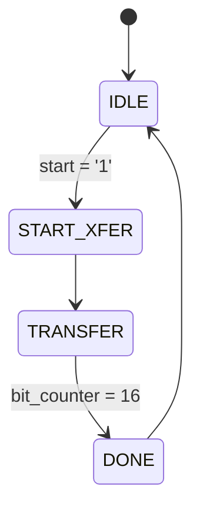

##
- **Projekt címe: Hangerőség mérő**
- **Hallgató neve: Csipor Antal**
- **Szak: Számotástechnika**
- **Tantárgy: Újrakonfigurálható digitális áramkörök**
- **Projekt véglegesítésének időpontja: *2025.1.10*
- **Fájlnév:**
  - FPGA_PROJEKT_CSIPOR_ANTAL_2024.pdf
  - FPGA_PROJEKT_CSIPOR_ANTAL_2024.md
  
  | Feladat            | Pontszám |
  | ------------------ |---------|
  | Jelenlét           | 9    	  |
  | Általános          | 6    	  |
  | Tervezés           | 8    	  |
  | Mérések            | 4     	 |
  | Dokumentáció össz. | 18    	 |
  | Tervezés           | 8    	  |
  | Implementálás      | 8    	  |
  | Szimuláció         | 6    	  |
  | Valós megvalósítás | 4     	 |
  | Valós rendszer     | 4     	 |
  | Projekt össz.      | 40      |
  | Kérdések           | -       |
  | Összesen           | 53      |

---

## A) Projekt célja

A projekt célja egy hangmérés rendszer tervezése és implementálása FPGA alapú platformon, amely PMOD MIC szenzor segítségével képes hangerő szintet mérni. A rendszer célja a hanghullámok intenzitásának valós idejű feldolgozása, lehetőséget biztosítva a hangszint mérések automatizálására, valamint a hangerő változásainak vizualizálására. Az alkalmazás célja lehet egyszerű hangdetektálás, hangerőség szint mérése.

A projekt során a következő célokat tűztük ki:
- A PMOD MIC szenzor integrálása az FPGA rendszerrel.
- A hangerő mérésének algoritmusainak megvalósítása.
- A mért adat vizualizálása 7 szegmenses LED kijelzőn (FPGA lapon található).
- A rendszer működésének tesztelése és optimalizálása.

---

## B) Követelmények

### a. Funkcionális
- **PMOD MIC szenzor csatlakoztatása:** Az FPGA-hoz csatlakoztatott PMOD MIC szenzornak megfelelően kell kommunikálnia az FPGA-n, biztosítva az adatátvitelt.
- **Hangmérési képesség:** A rendszernek képesnek kell lennie a PMOD MIC szenzor jelének digitális feldolgozására.
- **Valós idejű feldolgozás:** A hangerőt valós időben kell mérni és kiértékelni az FPGA segítségével.
- **Hangerő detektálása:** A rendszernek képesnek kell lennie érzékelni a különböző hangerő szinteket és ennek megfelelően reagálni (értékek kijelzése).

### b. Nem funkcionális
- **Teljesítmény:** A rendszernek képesnek kell lennie valós idejű működésre, minimális késleltetéssel, hogy a hang jelfeldolgozás folyamatos és zökkenőmentes legyen.
- **Megbízhatóság:** A rendszernek stabilnak kell lennie, és nem szabad, hogy a zaj vagy egyéb környezeti tényezők befolyásolják a mérések pontosságát.
- **Skálázhatóság:** A tervezett rendszer könnyen bővíthető további érzékelőkkel vagy adatfeldolgozó egységekkel a későbbi fejlesztésekhez.

---

## C) Tervezés


## Component Description Table

| **Callout** | **Component Description**                | **Callout** | **Component Description**                         |
|-------------|------------------------------------------|-------------|-------------------------------------------------|
| 1           | Power jack                               | 16          | JTAG port for (optional) external cable         |
| 2           | Power switch                             | 17          | Tri-color (RGB) LEDs                            |
| 3           | USB host connector                       | 18          | Slide switches (16)                             |
| 4           | PIC24 programming port (factory use)     | 19          | LEDs (16)                                       |
| 5           | Ethernet connector                       | 20          | Power supply test point(s)                      |
| 6           | FPGA programming done LED                | 21          | Eight digit 7-segment display                   |
| 7           | VGA connector                            | 22          | Microphone                                      |
| 8           | Audio connector                          | 23          | External configuration jumper (SD / USB)       |
| 9           | Programming mode jumper                  | 24          | MicroSD card slot                               |
| 10          | Analog signal Pmod port (XADC)           | 25          | Shared UART/ JTAG USB port                      |
| 11          | FPGA configuration reset button          | 26          | Power select jumper and battery header          |
| 12          | CPU reset button (for soft cores)        | 27          | Power-good LED                                  |
| 13          | Five pushbuttons                         | 28          | Xilinx Artix-7 FPGA                             |
| 14          | Pmod port(s)                             | 29          | DDR2 memory                                     |
| 15          | Temperature sensor                       |             |                                                 |


## Tervezési Szempontok

A Nexys A7 FPGA fejlesztőpanellel kapcsolatos tervezési folyamat során figyelembe kell venni a panelen található erőforrásokat és csatlakozási lehetőségeket. Az alábbiakban néhány fontos szempontot emelünk ki:

1. **7-szegmenses kijelző**:
  - A Nexys A7 nyolc számjegyes **7-szegmenses kijelzőt** tartalmaz, amely ideális számok vagy alapvető információk megjelenítésére.
  - Használható hibakeresési célokra, valós idejű adatok vizualizálására vagy egyszerű felhasználói felületként.

2. **PMODMIC Integráció**:
  - A **PMODMIC** (mikrofon modul) csatlakoztatható az egyik **Pmod porthoz**, amely a panelen található.
  - A mikrofonmodul lehetővé teszi valós idejű hangadatok rögzítését. Ehhez FPGA logika vagy soft-core feldolgozás implementálható.

3. **Tápellátás és csatlakozás**:
  - A panel többféle tápellátási lehetőséget kínál: **tápellátás csatlakozó** és **USB port**.
  - Használja a **power-good LED-et** és a **tápfeszültség tesztpontokat** a rendszer stabilitásának ellenőrzésére fejlesztés közben.

4. **Programozás és hibakeresés**:
  - Használja a **JTAG portot** és a **megosztott UART / JTAG USB portot** a programozáshoz és hibakereséshez.
  - Az **FPGA konfiguráció visszaállító gomb** és a **CPU visszaállító gomb** egyszerű vezérlést biztosít a rendszer újraindításához tesztelés során.

5. **Perifériabővítés**:
  - A **Pmod portok** lehetőséget kínálnak a rendszer egyszerű bővítésére további modulokkal (pl. érzékelők, aktuátorok, kommunikációs interfészek).
  - Biztosítsa a megfelelő jel-térképezést és konfigurációt az FPGA tervben, hogy ezek a perifériák működjenek.

### a. Tömbvázlat


---

## D) Tervezésnek a lépése

### a. Projekt modulok

#### i. Minden modulnak a tervezése
#### 1. Idődiagram (SPI)


forrás: https://www.ti.com/lit/ds/symlink/adcs7476.pdf

A rendszerben az SPI interfész a PMOD MIC szenzorról érkező digitális adat beolvasását végzi. A szenzor által generált digitális jel az alábbi formátumban érkezik:
- **4 vezető '0'-ás bit**, amelyek a keret szinkronizációjához szükségesek.
- **12 bites adat**, amely az ADC által digitalizált hangerő szintet tartalmazza.

Az SPI protokoll használata során a CS jel (Chip Select) kiemelt szerepet játszik. A CS jel:
- Alaphelyzetben **1**, amely az inaktív állapotot jelzi.
- Kommunikáció akkor indul, amikor a CS jel **0-ra vált**, így aktiválva az adatátvitelt.

Az idődiagram működését az alábbi jelek határozzák meg:
- **CS jel:** A kommunikáció aktiválásához és deaktiválásához szükséges.
- **SCLK jel:** Szinkronizálja a bitfolyamot.
- **MOSI vonal:** Nincs használva
- **MISO vonal:** Adatok fogadása a slave eszközről a master eszközre.

Az SPI idődiagram biztosítja az FPGA és a PMOD MIC közötti megbízható adatátvitelt az órajel és az adatjelek helyes időzítésével.

#### 2. Algoritmus

A beolvasott digitális jelet egy algoritmus dolgozza fel, amely az alábbi lépéseket tartalmazza:
- **Adatpufferelés:** Az SPI interfészen érkező adatokat egy pufferben tároljuk, hogy az adatfolyam folytonosságát biztosítsuk.
- **Maximális hangerő számítása:** A 12 bites adat alapján a rendszer kiszámolja a beérkező hanghullámok maximális amplitúdóját.
  - A számítás az alábbi képlet alapján történik:
  ```math
  Hangerő (dB) = 20 \cdot \log_{10} \left( \frac{RMS}{\text{Referencia érték}} \right)
  ```
    ahol:
    - **RMS**: Az időtartománybeli jel gyök-négyzet középértéke, amelyet az alábbi módon számítunk ki:
      ```math
      RMS = \sqrt{\frac{1}{N} \sum_{i=1}^{N} x[i]^2}
      ```
      - \(x[i]\): A digitális jelszintek értéke az egyes mintákból.
      - \(N\): Az összes minta száma a számításhoz.
    - **Referencia érték**: Az a maximális amplitúdóérték, amelyhez a mért RMS értéket viszonyítjuk.
  - Ez az RMS (Root Mean Square) számítás, amely az időtartománybeli jel intenzitását adja meg, majd ezt dB-ben (decibelben) fejezzük ki a logaritmikus átalakítás révén.
- **Hangerő skálázása:** A számított értékeket normalizáljuk, hogy azok a kijelző által kezelhető formában legyenek (pl. BCD kódolás a 7 szegmenses kijelzőhöz).

#### 3. Kijelző vezérlő modul (7 szegmenses LED)

A mért hangerő szinteket a 7 szegmenses LED kijelző jeleníti meg az FPGA-n. A kijelző vezérlése a következő lépésekből áll:
- **Adatkonverzió:** A mért hangerőszintet bináris formátumból BCD formátumba alakítjuk.
- **Multiplexálás:** Több számjegy esetén multiplexálást alkalmazunk, hogy a kijelzők gyorsan és váltakozva mutassák a megfelelő értékeket.
- **Kijelző meghajtása:** A kijelző szegmenseit vezérlő jeleket a feldolgozott adatok alapján generáljuk, amely a megfelelő számjegyek megjelenítéséért felel.

A mért hangerőséget megjelenitjuk az FPGAán található 7 szegmenses kijelzőn.

#### ii. FSMD
#### 1. Állapotdiagram
Az alábbi állapotdiagram bemutatja a **SPI Master** FSM (Finite State Machine with Datapath) működését. Az FSM négy fő állapotból áll: **IDLE**, **START_XFER**, **TRANSFER** és **DONE**.


Állapotok leírása:

- IDLE: Alaphelyzet, várakozik a start jel aktiválására.
- START_XFER: Az SPI kommunikáció megkezdése, aktiválja a Chip Select (CS) jelet.
- TRANSFER: Adatok átvitele történik, minden sck órajelcsengésnél egy bitet shift-el a regiszterbe.
- DONE: Az adatátvitel befejeződött, deaktiválja a CS jelet és jelezni fogja az adatok készenlétét.


#### 2. Táblázat fázisműveletekkel
Az alábbi táblázat összefoglalja az FSM állapotait, a bemeneteket, a következő állapotokat és a kimeneteket minden egyes fázisban.
## 2. Táblázat fázisműveletekkel

Az alábbi táblázat az FSM (Végállapotú Automata) működését mutatja be, beleértve az állapotokat, bemeneteket, következő állapotokat és kimeneteket minden fázisban.

| **Jelenlegi Állapot** | **Bemenet**               | **Következő Állapot** | **Kimenetek**                                                |
|-----------------------|--------------------------|-----------------------|-------------------------------------------------------------|
| IDLE                 | `start = '1'`           | START_XFER           | `CS = '0'`, `bit_counter = 0`, `data_ready = '0'`          |
| START_XFER           | `-`                     | TRANSFER             | `-`                                                        |
| TRANSFER             | `bit_counter < 16`      | TRANSFER             | `bit_counter += 1`, Shift regiszter frissítése             |
| TRANSFER             | `bit_counter = 16`      | DONE                 | `-`                                                        |
| DONE                 | `-`                     | IDLE                 | `CS = '1'`, `data_ready = '1'`, `adc_data` frissítése      |
| [*] (egyéb állapotok) | `-`                     | IDLE                 | `-`                                                        |

### Táblázat magyarázata

- **Jelenlegi Állapot**: Az FSM aktuális állapota, amely meghatározza, hogy a rendszer éppen melyik fázisban van.
- **Bemenet**: Az állapotváltozást befolyásoló bemeneti feltételek. Ha nincs specifikus bemenet, azt `-` jelöli.
- **Következő Állapot**: Az FSM új állapota, amely az aktuális állapotból és a bemenetek alapján alakul ki.
- **Kimenetek**: Az adott állapothoz tartozó kimeneti jelek és műveletek, amelyek végrehajtódnak az adott fázisban. Ha nincs művelet, azt `-` jelöli.


#### 3. Áramköri rajz

Az alábbi áramköri rajz szemlélteti a SPI Master modul kapcsolatait és belső komponenseit az FPGA-n belül. A rajz tartalmazza a főbb jeleket, mint a clk, reset, start, miso, sck, cs, valamint a kimeneteket (adc_data, data_ready).


[image]

Áramköri rajz elemei:

- **CLK**: Rendszerórajel bemenet.
- **RESET**: Aktív magas reset jel.
- **START**: SPI átvitel indító jel.
- **MISO**: Master In Slave Out adatvonal.
- **SCK**: SPI órajeljel.
- **CS**: Chip Select jel, aktív alacsony.
- **ADC_DATA**: 12-bites digitális adat kimenet.
- **DATA_READY**: Adat készenlét jelző kimenet.

#### 4. VHDL kódok

Az alábbiakban bemutatjuk a spi_master.vhd kulcsfontosságú VHDL kódját, amely a FSM működését és az adatátvitelt kezeli.

#### 4.2. Órajel Generálás
Az SPI kommunikációhoz 25 MHz-es órajelet generálunk a rendszerórajelből (100 MHz).


```
process(clk, reset)
begin
  if reset = '1' then
    clk_divider   <= 0;
    spi_clk_reg   <= '1';
  elsif rising_edge(clk) then
    if clk_divider = DIVISOR-1 then
      clk_divider <= 0;
      spi_clk_reg <= not spi_clk_reg;
    else
      clk_divider <= clk_divider + 1;
    end if;
  end if;
end process;

sck <= spi_clk_reg;
```

#### Magyarázat
- **Reset állapot**: A számlálók és regiszterek nullázása történik, ha a reset aktív ('1').
- **Órajel osztás**: A clk_divider növekszik minden emelkedő élre. Ha eléri a maximális értéket, az spi_clk_reg invertálódik.
- **Kimenet**: Az sck jel a generált SPI órajelet követi.

### 4.3. FSM Működés
Az FSM négy állapotot tartalmaz: IDLE, START_XFER, TRANSFER, DONE.

```
fsm_reg: process(spi_clk_reg, reset)
begin
  if reset = '1' then
  current_state   <= IDLE;
  bit_counter     <= 0;
  shift_reg       <= (others => '0');
  data_ready_reg  <= '0';
  cs_reg          <= '1';
  adc_data_reg    <= (others => '0');
elsif rising_edge(spi_clk_reg) then
  current_state <= next_state;

        case current_state is
        
            when IDLE =>
                null;  -- Alapállapot

            when START_XFER =>
                cs_reg <= '0';
                bit_counter <= 0;
                shift_reg       <= (others => '0');
                data_ready_reg  <= '0';

            when TRANSFER =>
                if bit_counter < 16 then
                    bit_counter <= bit_counter + 1;
                end if;

            when DONE =>
                cs_reg <= '1';
                data_ready_reg <= '1';
                if shift_reg(15 downto 12) = "0000" then
                    adc_data_reg <= shift_reg(11 downto 0);
                end if;

            when others =>
                null;
        end case;
    end if;
end process;
```

#### Magyarázat
- **IDLE**: Alapállapot, várakozás a start jelre.
- **START_XFER**: Az SPI kommunikáció kezdete.
- **TRANSFER**: Bitek átvitele és a számláló növelése.
- **DONE**: Az átvitel befejezése, adatok ellenőrzése és mentése.

### 4.4. Következő Állapot Logika
Ez határozza meg az FSM következő állapotát.

```
fsm_next: process(current_state, start, bit_counter)
begin
case current_state is
when IDLE =>
if start = '1' then
next_state <= START_XFER;
end if;

        when START_XFER =>
            next_state <= TRANSFER;

        when TRANSFER =>
            if bit_counter = 16 then
                next_state <= DONE;
            end if;

        when DONE =>
            next_state <= IDLE;

        when others =>
            next_state <= IDLE;
    end case;
end process;
```

#### Magyarázat
- **Átmenet logika**: Az FSM állapotokat a bemenetek és feltételek alapján frissíti.
- **Példák**:
  - IDLE → START_XFER: Ha start = '1'.
  - TRANSFER → DONE: Ha bit_counter = 16.
### 4.5. MISO Adatfogadás
Az SPI órajel csökkenő élén érkező adatokat a shift_reg frissíti.


```
process(clk, reset)
variable spi_clk_prev: std_logic := '1';
begin
if reset = '1' then
shift_reg <= (others => '0');
spi_clk_prev := '1';
elsif rising_edge(clk) then
if (spi_clk_prev = '1') and (spi_clk_reg = '0') then
if current_state = TRANSFER and bit_counter < 16 then
shift_reg <= shift_reg(14 downto 0) & miso;
end if;
end if;
spi_clk_prev := spi_clk_reg;
end if;
end process;
```

#### Magyarázat
- **Falling edge érzékelése**: A jel csökkenő élét a spi_clk_prev segítségével érzékeljük.
- **Adat shiftelése**: A beérkező bit bekerül a shift_reg alsó bit pozíciójába.
### 4.6. Kimenetek
Az FSM kimeneti jelei.
```
cs         <= cs_reg;
data_ready <= data_ready_reg;
adc_data   <= adc_data_reg;
```

#### Magyarázat
- **cs**: A chip select jel (alacsony állapotban aktív).
- **data_ready**: Jelzi, hogy az adat készen áll.
- **adc_data**: A 12-bites ADC adatot tartalmazza.

---

## E) Tesztelés

### a. Szimuláció (tömbvázlat)
A szimulációt a spi_master modulra végezzük, és ehhez egy testbench-et (spi_master_tb.vhd) használunk. A tesztbench felelős az SPI kommunikáció szimulálásáért, az órajelek előállításáért és a bemenetek stimulálásáért.


#### i. VHDL
Az alábbiakban bemutatjuk a `spi_master_tb.vhd` tesztbench kódját.

#### Tesztbench Komponensei
### 1. Órajel Generálás
A `clk_process` biztosítja a 100 MHz-es rendszerórajelet az FPGA számára.

```
clk_process : process
begin
clk <= '0';
wait for CLK_PERIOD/2;  -- 5 ns
clk <= '1';
wait for CLK_PERIOD/2;  -- 5 ns
end process;
```
- **Funkció**: Egy 10 ns periódusú órajel létrehozása (100 MHz).
- **Működés**: A clk jelet minden fél perióduson (5 ns) invertálja.

### 2. Stimulus Process
   A `stim_proc` kezdetben aktiválja a reset jelet, majd szimulál két SPI tranzakciót.

```
stim_proc: process
begin		
    -- Initialize Inputs
    reset <= '1';
    start <= '0';
    wait for 20 ns;
    reset <= '0';
    wait for 90 ns;

    -- First SPI Transaction
    start <= '1';
    wait for 40 ns;
    start <= '0';
    wait for 500 ns;

    -- Second SPI Transaction
    start <= '1';
    wait for 40 ns;
    start <= '0';
    wait for 500 ns;

    -- Finish simulation
    wait;
end process;
```
- **Reset**: A kezdeti reset állapot beállítása.
- **SPI tranzakciók**: A start jel időzített aktiválásával SPI kommunikációt indít.

### 3. MISO Szimuláció
   A `miso_process` az SPI órajelek alapján frissíti a miso jelet.


```
miso_process: process
begin
  wait until rising_edge(sck);     
  miso <= DATA_TO_SEND(15 - bit_index);
  bit_index <= (bit_index + 1) mod 16;
end process;
```
- **Működés**: A miso jel értéke a `DATA_TO_SEND` konstans következő bitjére frissül.
- **Bit-index**: Nyomon követi az aktuális bitet, amelyet a miso vonalon kell megjeleníteni.

### 4. Monitoring Process
   A `monitor_proc` ellenőrzi az `adc_data` kimenet értékét.

```
monitor_proc: process(clk)
  begin
  if rising_edge(clk) then
    if data_ready = '1' then
      assert (adc_data = "001000110100")
      report "ADC Data Ready: " & integer'image(to_integer(unsigned(adc_data)))
      severity note;
    end if;
  end if;
end process;
```
- **Funkció**: Ellenőrzi, hogy az `adc_data` tartalma megfelel-e a várt értéknek.
- **Hibakezelés**: Ha az `adc_data` nem egyezik, hibaüzenetet ad.


### ii. Szimuláció eredményei


### c. Mérések

---


